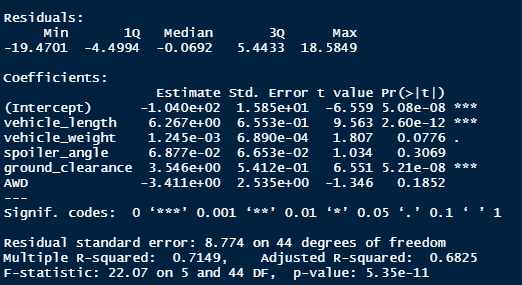
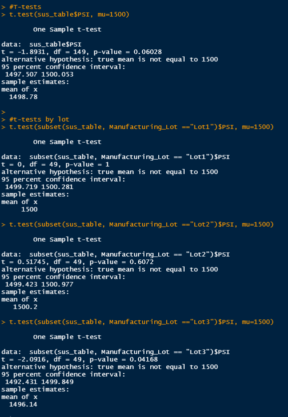

# Mecha Car: Statistical Analysis

## Linear Regression to Predict MPG

 
 
Vehicle Length and Ground Clearance are the intercepts that provide nonrandom variance to the linear model as they are the points that will affect MPG directly as they change. The slope of the linear model is nonzero as the p-value lies under our threshold of significance, 0.05 > 5.25e-11. The linear model has a the r-value is 0.7149, within the range of strong postive correlation with MPG.

## Summary Statistics on Suspension Coils

 
 
 

The company's design specifications dictate that the variance of the suspension coils must no exceed 100 pounds per inch. The manufacturing lots all together meet these requirements but when looking at the lots individually, Lot 3 in particular doesn't meet the specifications. This may come from the higher standard deviation when it comes to Lot 3 as this means the data points are more spread out. This can be remedied by adding more cars that fit the design or removing outliers in the lot.

## T-Tests on Suspension Coils,

 

The lots as a whole are not statistically significant as the p-value is not significant. Lots 1 and 2 follow suit as their p-values are above .05 but Lot 3, has a p-value that is significant as the p-value is very low at .042.

## Study Design: MechaCar vs Competition

think critically about what metrics would be of interest to a consumer: for a few examples, cost, city or highway fuel efficiency, horse power, maintenance cost, or safety rating. 

My study will measure cost against fuel efficiency, maintainance cost and veicle weight. The hypothesis will be specifically looking to see if there is any correlation between the model and the intecept so I will be using a linear model. To run this test I would need the data from various car models of the company to compare and constrast them to find which variables directly affect cost and how that in turn affects the final sales.
