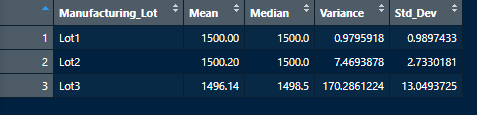

# MechaCar_Statistical_Analysis

## Linear Regression to Predict MPG

 
 
Vehicle Length and Ground Clearance are the intercepts that provide nonrandom variance to the linear model as they are the points that will affect MPG directly as they change. The slope of the linear model is nonzero as the p-value lies under our threshold of significance, 0.05 > 5.25e-11. The linear model has a the r-value is 0.7149, within the range of strong postive correlation with MPG.

## Summary Statistics on Suspension Coils

 
 
 

The company's design specifications dictate that the variance of the suspension coils must no exceed 100 pounds per inch. The manufacturing lots all together meet these requirements but when looking at the lots individually, Lot 3 in particular doesn't meet the specifications. This may come from the higher standard deviation when it comes to Lot 3 as this means the data points are more spread out. This can be remedied by adding more cars that fit the design or removing outliers in the lot.

## T-Tests on Suspension Coils,

 

then briefly summarize your interpretation and findings for the t-test results.

## Study Design: MechaCar vs Competition

Write a short description of a statistical study that can quantify how the MechaCar performs against the competition. In your study design, think critically about what metrics would be of interest to a consumer: for a few examples, cost, city or highway fuel efficiency, horse power, maintenance cost, or safety rating. 

    What metric or metrics are you going to test?
    What is the null hypothesis or alternative hypothesis?
    What statistical test would you use to test the hypothesis? And why?
    What data is needed to run the statistical test?
